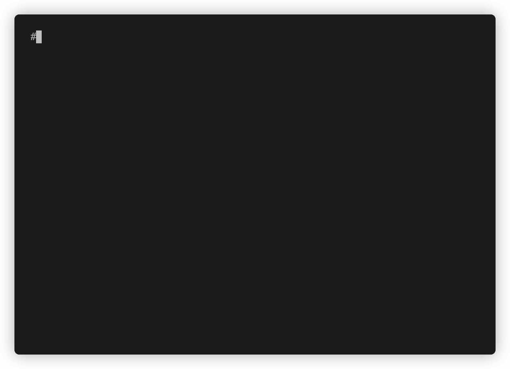

# Stegano

[](https://www.gnu.org/licenses/gpl-3.0)
[](https://github.com/steganogram/stegano-rs/actions?query=branch%3Amain+workflow%3ABuild+)
[](https://deps.rs/repo/github/steganogram/stegano-rs)
[](https://codecov.io/gh/steganogram/stegano-rs)
[](https://github.com/Aaronepower/tokei)

A cross-platform command line tool for steganography, focused on performance and simplicity.

## Demo



## Features

- Simple and easy-to-use command line tool
- Cross-platform support (Windows, macOS and Linux)
- Support Media formats like:
  - PNG Images
  - WAV Audio
- Hides one or many files in a carrier media
- Hides one-liner text messages in a carrier media
- Based on [least significant bit steganography][lsb]
- Backwards compatible to [stegano for windows for image en-/decoding][stegano/win]
- Memory safe by design
- Written in [rust](https://www.rust-lang.org/)

[lsb]: https://youtu.be/ARDhkujNXrY?t=705
[stegano/win]: https://www.stegano.org/pages/downloads-en.html

## What is steganography?

In short, the art of hiding information in something (like a book, a image, a audio or even a video). 
[][slides]
You can find more information [on my slides][slides] or checkout [my talk on the rust meetup munich in june, 2020][meetup].

[slides]: https://speakerdeck.com/sassman/steganography-in-rust
[meetup]: https://youtu.be/ARDhkujNXrY?t=366

## Install

### On Linux as snap

[](https://snapcraft.io/stegano)

- installation [for Linux Mint](https://snapcraft.io/install/stegano/mint)
- installation [for Arch Linux](https://snapcraft.io/install/stegano/arch)

*TL;DR:*
```sh
sudo snap install stegano
```

### With cargo

To install the stegano cli, you just need to run

```sh
❯ cargo install --force stegano-cli
```

(--force just makes it update to the latest `stegano-cli` if it's already installed)

*Note* the binary is called `stegano` (without `-cli`)

to verify if the installation went thru, you can run `which stegano` that should output similar to

```sh
$HOME/.cargo/bin/stegano
```

### AUR

`stegano` can be installed from available [AUR packages](https://aur.archlinux.org/packages/?O=0&SeB=b&K=stegano&outdated=&SB=n&SO=a&PP=50&do_Search=Go) using an [AUR helper](https://wiki.archlinux.org/index.php/AUR_helpers). For example,

```sh
❯ yay -S stegano
```

## Usage

```sh
❯ stegano --help
Stegano CLI 0.4.0
Sven Assmann <sven.assmann.it@gmail.com>
Hiding secret data with steganography in PNG images and WAV audio files

USAGE:
    stegano [SUBCOMMAND]

FLAGS:
    -h, --help       Prints help information
    -V, --version    Prints version information

SUBCOMMANDS:
    help          Prints this message or the help of the given subcommand(s)
    hide          Hides data in PNG images and WAV audio files
    unveil        Unveils data from PNG images
    unveil-raw    Unveils raw data in PNG images
``` 

## Subcommands

### hide

```sh
❯ stegano hide --help
stegano-hide
Hides data in PNG images and WAV audio files

USAGE:
    stegano hide [FLAGS] [OPTIONS] --data <data file> --in <media file> --out <output image file>

FLAGS:
        --x-force-content-version-2    Experimental: enforce content version 2 encoding (for backwards compatibility)
    -h, --help                         Prints help information
    -V, --version                      Prints version information

OPTIONS:
    -d, --data <data file>           File(s) to hide in the image
    -i, --in <media file>            Media file such as PNG image or WAV audio file, used readonly.
    -m, --message <text message>     A text message that will be hidden
    -o, --out <output image file>    Final image will be stored as file
```

#### Example with am Image PNG file

Let's illustrate how to hide a file like `README.md`, inside an image `Base.png` and save it as `README.png`:

```sh
❯ stegano hide --data README.md --in resources/plain/carrier-iamge.png --out README.png
```

The final result is then contained in the image `README.png`.

*Pro TIP* you can hide multiple files at once

here I'm using the shorthand parameters (--data, -d), (--in, -i), (--out, -o)

```sh
❯ stegano hide \
  -i resources/plain/carrier-image.png \
  -d resources/secrets/Blah.txt \
     resources/secrets/Blah-2.txt \
  -o secret.png
```

*Hidden Feature* you can use a `.jpg` for input and save it as `.png`

```sh
❯ stegano hide \
  -i resources/NoSecret.jpg \
  -d resources/secrets/Blah.txt \
  -o secret.png
```

#### Example with an Audio WAV file

```sh
❯ stegano hide \
  -i resources/plain/carrier-audio.wav \
  -d resources/secrets/Blah.txt \
     resources/secrets/Blah-2.txt \
  -o secret.wav
```

#### Example Hide short messages

Now let's assume we want to hide just a little text message in `secret-text.png`. So we would run:

```sh
❯ stegano hide \
  -i resources/NoSecrets.jpg \
  -m 'This is a super secret message' \
  -o secret-text.png
```

### unveil

```sh
❯ stegano unveil --help
stegano-unveil
Unveils data from PNG images

USAGE:
    stegano unveil --in <image source file> --out <output folder>

FLAGS:
    -h, --help       Prints help information
    -V, --version    Prints version information

OPTIONS:
    -i, --in <image source file>    Source image that contains secret data
    -o, --out <output folder>       Final data will be stored in that folder
```

#### Example unveil from an Image PNG file

Let's unveil the `README.md` that we've hidden (just above) in `README.png`

```sh
❯ stegano unveil --in README.png --out ./

❯ file README.md
README.md: UTF-8 Unicode text
```

#### Example unveil short messages

Now let's unveil the message from above `secret-text.png`. So we would run:

```sh
❯ stegano unveil \
  -i secret-text.png \
  -o message

❯ cat message/secret-message.txt
This is a super secret message
```

### unveil-raw

```sh
❯ stegano unveil-raw --help
stegano-unveil-raw
Unveils raw data in PNG images

USAGE:
    stegano unveil-raw --in <image source file> --out <output file>

FLAGS:
    -h, --help       Prints help information
    -V, --version    Prints version information

OPTIONS:
    -i, --in <image source file>    Source image that contains secret data
    -o, --out <output file>         Raw data will be stored as binary file
```

#### Example unveil raw data

Let's unveil the raw data of the `README.md` that we've hidden just above in `README.png`

```sh
❯ stegano unveil-raw --in README.png --out README.bin
```

The file `README.bin` contains all raw binary data unfiltered decoded by the LSB decoding algorithm. 
That is for the curious people, and not so much interesting for regular usage.

## stegano on the web

- [announcement on reddit](https://www.reddit.com/r/rust/comments/fbavos/command_line_steganography_for_png_images_written/)

## Contribute

To contribute to stegano-rs you can either checkout existing issues [labeled with `good first issue`][4] or [open a new issue][5]
 and describe your problem.
  
Also every PR is welcome, just as a note of caution: at this very time the architecture and the API are still in flux and might change, so in any case I recommend opening an issue first to discuss a code contribution. 

## License

- **[GNU GPL v3 license](https://www.gnu.org/licenses/gpl-3.0)**
- Copyright 2019 - 2021 © [Sven Assmann][2].

[2]: https://www.d34dl0ck.me
[3]: https://en.wikipedia.org/wiki/Steganography
[4]: https://github.com/steganogram/stegano-rs/issues?q=is%3Aissue+is%3Aopen+label%3A%22good+first+issue%22
[5]: https://github.com/steganogram/stegano-rs/issues/new/choose