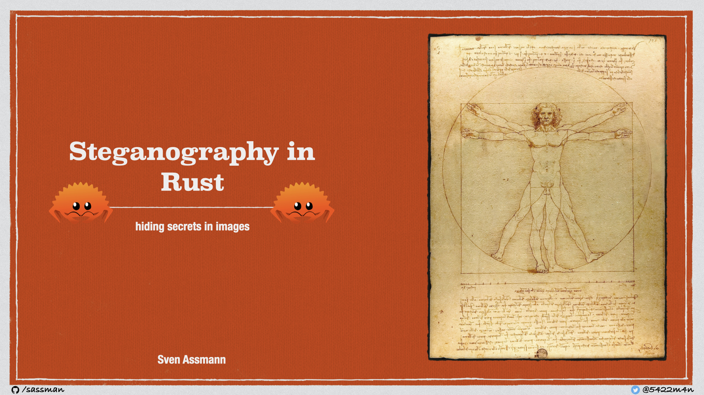

# Stegano CLI

[](https://www.gnu.org/licenses/gpl-3.0)
[](https://travis-ci.org/steganogram/stegano-rs)
[](https://codecov.io/gh/steganogram/stegano-rs)
[](https://github.com/Aaronepower/tokei)

Implementation of [least significant bit steganography][lsb] for PNG images and WAV audio files in rust-lang.

Aims for compatibility to the [Stegano for windows version regarding image en-/decoding][1]

[lsb]: https://youtu.be/ARDhkujNXrY?t=705

## What is steganography?

In short, the art of hiding information in something (like a book, a image, a audio or even a video). 
[][slides]
You can find more information [on my slides][slides] or checkout [my talk on the rust meetup munich in june, 2020][meetup].

[slides]: https://speakerdeck.com/sassman/steganography-in-rust
[meetup]: https://youtu.be/ARDhkujNXrY?t=366

## Watch it in action

[](https://asciinema.org/a/gNNTVcj6EZm3ZTaihZYoC7rfC)

## Quick Start

### Install

To install the stegano cli, you just need to run

```bash
cargo install --force stegano-cli
```

(--force just makes it update to the latest `stegano-cli` if it's already installed)

*Note* the binary is called `stegano` (without `-cli`)

to verify if the installation went thru, you can run `which stegano` that should output similar to

```sh
$HOME/.cargo/bin/stegano
```

### Hide data

Let's assume we want to hide data of a file called `README.md`, into an image called `HelloWorld.png`, based on a image called `resources/with_attachment/Blah.txt.png`. So we would run:

```sh
stegano hide \
 --data README.md \
 --in resources/Base.png \
 --out README.png
```

The final result is then contained in the image `README.png`.

*Pro TIP* you can hide multiple files at once

here I'm using the shorthand parameters (--data, -d), (--in, -i), (--out, -o)

```sh
stegano hide \
  -i resources/Base.png \
  -d resources/secrets/Blah.txt \
     resources/secrets/Blah-2.txt \
  -o secret.png
```

*Hidden Feature* you can use a `.jpg` for input and save it as `.png`

```sh
stegano hide \
  -i resources/NoSecret.jpg \
  -d resources/secrets/Blah.txt \
  -o secret.png
```

### Hide short messages

Now let's assume we want to hide just a little text message in `secret-text.png`. So we would run:

```sh
stegano hide \
  -i resources/NoSecrets.jpg \
  -m 'This is a super secret message' \
  -o secret-text.png
```

### Unveil data

Let's unveil the `README.md` that we've hidden just above in `README.png`

```sh
stegano unveil \
 --in README.png \
 --out ./
```

### Unveil short messages

Now let's unveil the message from above `secret-text.png`. So we would run:

```sh
stegano unveil \
  -i secret-text.png \
  -o message

cat message/secret-message.txt
This is a super secret message
```

### Unveil Raw data

Let's unveil the raw data of the `README.md` that we've hidden just above in `README.png`

```sh
stegano unveil-raw \
 --in README.png \
 --out README.bin
```

The file `README.bin` contains all raw data unfiltered decoded by the LSB decoding algorithm. That is for the curious people, and not so much interesting.

## Contribute

To contribute to stegano-rs, please see open an issue on github, please note that at 
this very time the architecture and the API is still in flux and might change. 

## License

- **[GNU GPL v3 license](https://www.gnu.org/licenses/gpl-3.0)**
- Copyright 2019 © [Sven Assmann][2].

[1]: https://www.stegano.org/pages/downloads-en.html
[2]: https://www.d34dl0ck.me
[3]: https://en.wikipedia.org/wiki/Steganography